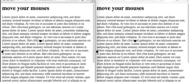

# mousemouse

Quick proof of concept to demonstrate sending mouse movements from one browser to another. Made with meteorjs.



## try

### server

````
cd server
meteor
````

### browser

open `clientplugin-tester/test.html` in several browsers or browser windows

## develop 

````
cd browserplugin
gem install kicker -s http://gemcutter.org
npm install -g browserify
npm run watch
````

## install on heroku

````
heroku git:remote -a <heroku_name>
heroku buildpacks:set https://github.com/AdmitHub/meteor-buildpack-horse.git
heroku addons:create mongolab:sandbox
heroku config:set METEOR_APP_DIR=server/
heroku config:set ROOT_URL=<heroku_url>
git push heroku
````

then edit config in `cllientplugin/src/mousemouse.js` and run `npm run build`